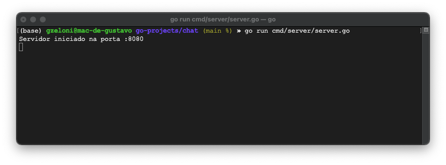
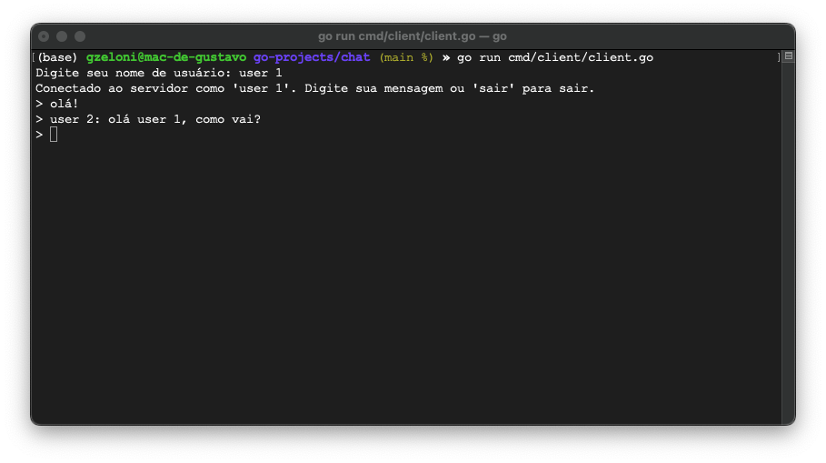
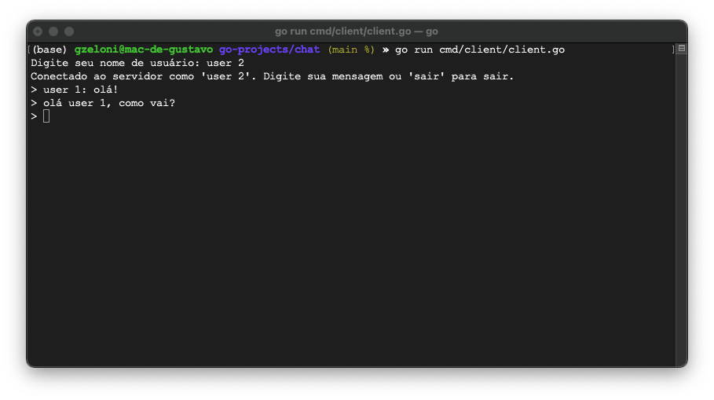

# GO CHAT WS

### Para rodar esse projeto, você precisa do Go SDK instalado em sua máquina.

### Abra três janelas de terminal:
- Primeira janela é para o server. Rode o comando: 
```bash
go run cmd/server/server.go
```
- Segunda e terceira janela são para os clients. Você precisa de dois clients em execução para poder ver o envio e recebimento das mensagens (ou use duas máquinas `¯\_(ツ)_/¯` ). Rode o comando: 
```bash
go run cmd/client/client.go
```

| SERVER | CLIENT 1 | CLIENT 2 |
|---|---|---|
|  |  |  |